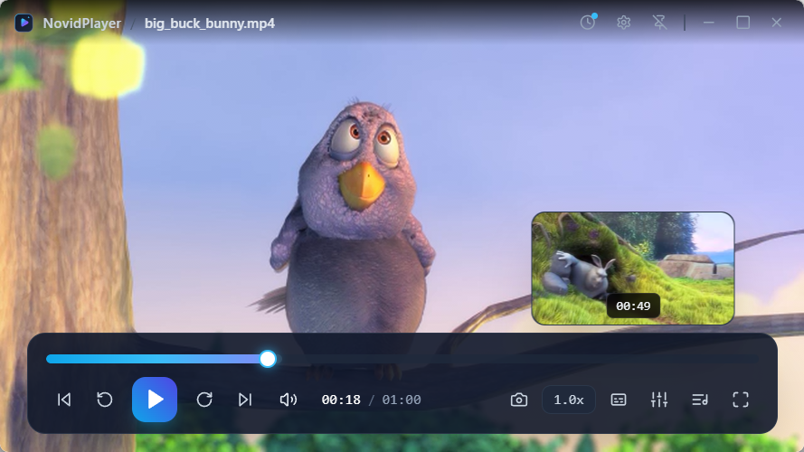

# 🎬 NovidPlayer

<p align="center">
  <strong>专为 Windows 11 打造的高性能、极简、现代化本地视频播放器。</strong>
</p>

<p align="center">
  <a href="https://github.com/Thief-K/novid-player/releases"></a>
  <a href="https://github.com/Thief-K/novid-player/actions/workflows/ci.yml"></a>
  <a href="LICENSE"></a>
  <a href="https://tauri.app"></a>
  
  <a href="CONTRIBUTING.md"></a>
</p>

<p align="center">
  <a href="README.md">English</a> | <strong>简体中文</strong>
</p>

<p align="center">
  
</p>

---

## ✨ 核心特性

- **现代流媒体视觉 (OSD)**：全屏无边框毛玻璃沉浸式界面，控制栏自动隐藏与智能唤醒。
- **自适应视频原生分辨率**：打开视频时自动按 1:1 原生像素调整窗口大小并居中；4K/8K 超高清视频智能约束在屏幕工作区 85% 以内，防止溢出。
- **MPV 硬件加速**：Direct3D 11 / NVDEC 原生硬解，超低 CPU 占用流畅播放 4K 60fps 10-bit HEVC / AV1 视频。
- **流媒体级实时缩略图预览**：悬停 300ms 智能激活高清画面预览卡片，支持平滑横向拖拽与 LRU 毫秒级内存缓存。
- **桌面级级联右键菜单**：纯净单列菜单，提供倍速与画面比例的悬停级联二级子菜单（带生效指示与智能边界翻折）。
- **原生多语言国际化 (i18n)**：支持简体中文与 English，支持跟随 Windows 系统语言或手动无缝切换。
- **Windows 原生集成与快速打开方式**：全面关联主流音视频格式，安装后即可在 Windows 资源管理器右键“打开方式”中一键起播；支持单实例跨进程唤醒与多文件切换。
- **4 标签设置中心**：常规偏好、硬件解码管线配置（带 GPU 兼容回退检测与提示）、快捷键速查与一键导出系统诊断信息。
- **专业播放控制**：
  - **音量增强**：0% ~ 150% 增益调节；
  - **无级倍速**：0.25x ~ 4.0x 精确微调与常用预设；
  - **音轨与外挂字幕**：支持 `.srt / .ass / .vtt` 拖拽载入与毫秒级时延校准；
  - **色彩与画面比例**：16:9 / 4:3 / 21:9 强制比例，亮暗度与对比度微调；
  - **播放记忆与列表**：自动记忆历史断点，抽屉式播放列表支持多文件拖拽与片尾从头重播。

---

## ⌨️ 快捷键速查

| 快捷键       | 功能              | 快捷键            | 功能                |
| :----------- | :---------------- | :---------------- | :------------------ |
| **Space**    | 播放 / 暂停       | **F / 双击画面**  | 进入 / 退出全屏     |
| **← / →**    | 快退 5s / 快进 5s | **Shift + ← / →** | 精确步进 1s         |
| **↑ / ↓**    | 音量调节 ±5%      | **M**             | 静音切换            |
| **[ / ]**    | 播放速度 ±0.1x    | **Backspace**     | 恢复 1.0x 正常倍速  |
| **C / V**    | 切换字幕 / 音轨   | **S**             | 高清截图至相册      |
| **. / ,**    | 逐帧前进 / 后退   | **L**             | 打开 / 收起播放列表 |
| **Ctrl + O** | 选择本地文件      | **Escape**        | 退出全屏 / 关闭弹窗 |

---

## 🚀 快速开始

### 📦 软件下载

前往 [GitHub Releases](https://github.com/Thief-K/novid-player/releases) 下载最新构建版本：

- **安装包版本**：`NovidPlayer-vX.Y.Z-setup.exe` (NSIS 安装程序)
- **免安装便携版**：`NovidPlayer-vX.Y.Z-windows-x64-portable.zip`（解压即用，纯绿色不污染注册表）

---

### 🛠️ 源码构建与开发

#### 环境要求

- **Node.js** >= 18, `pnpm` >= 9
- **Rust toolchain** (stable-x86_64-pc-windows-msvc)

```powershell
# 1. 克隆代码库并安装依赖
git clone https://github.com/Thief-K/novid-player.git
cd novid-player
pnpm install

# 2. 自动下载并配置 MPV 核心依赖
pnpm setup-mpv

# 3. 启动桌面开发模式
pnpm tauri dev

# 4. 构建发布版 Windows 安装包 (NSIS)
pnpm tauri build
```

---

## 📖 开发者与架构文档

- **架构手册与 AI 规范**：关于项目的底层 IPC 通信设计、Direct3D 11 渲染机制、目录架构以及编码规范，请参阅 [AGENTS.md](AGENTS.md)。
- **社区贡献**：参与代码贡献前请先查阅 [CONTRIBUTING.md](CONTRIBUTING.md)。

---

## 📜 开源许可证

NovidPlayer 遵循 [GNU General Public License v3.0 (GPL-3.0)](LICENSE) 协议开源。
第三方开源组件的版权与许可声明详见 [THIRD_PARTY_LICENSES.md](THIRD_PARTY_LICENSES.md)。
